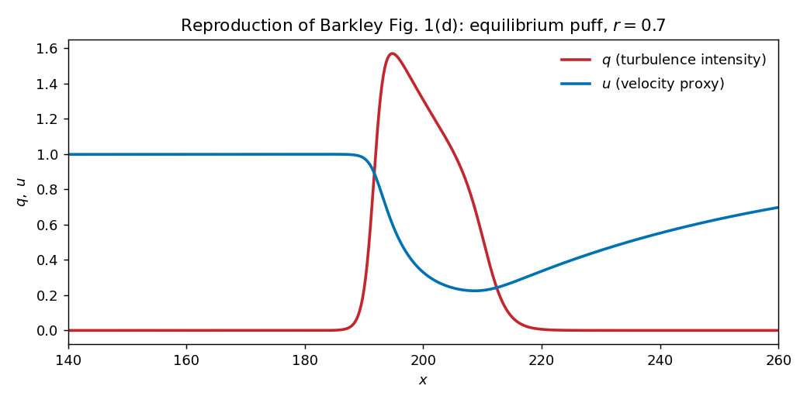
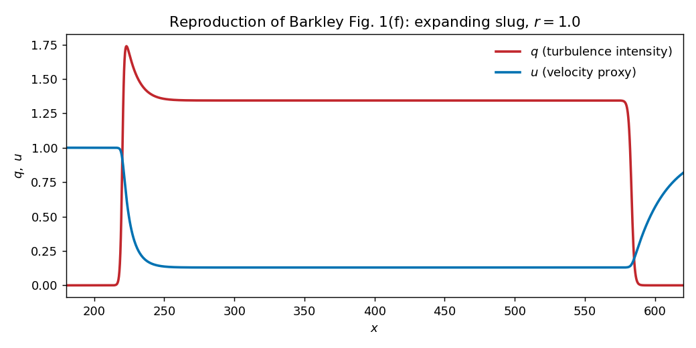
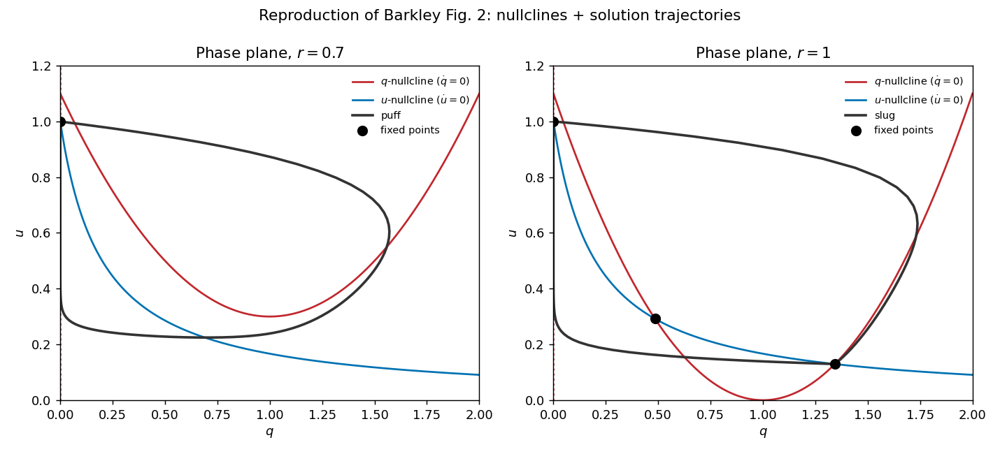
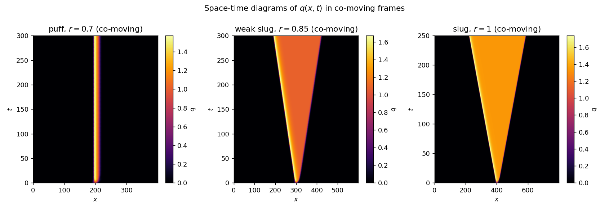
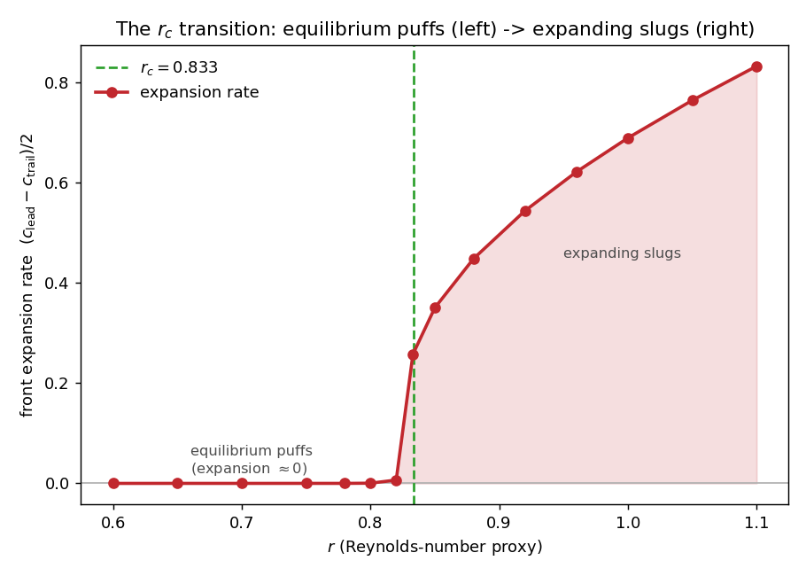
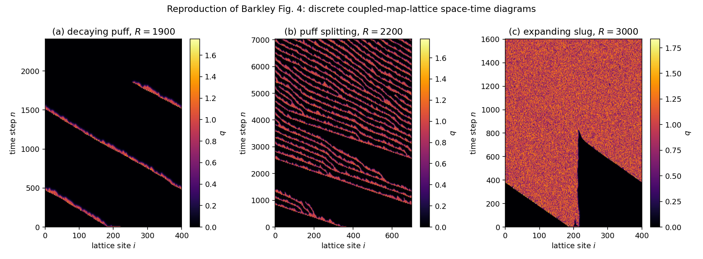
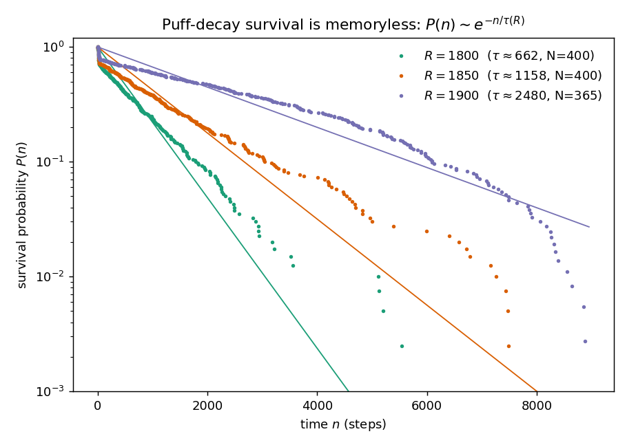
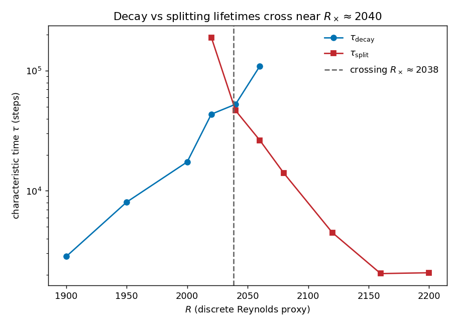
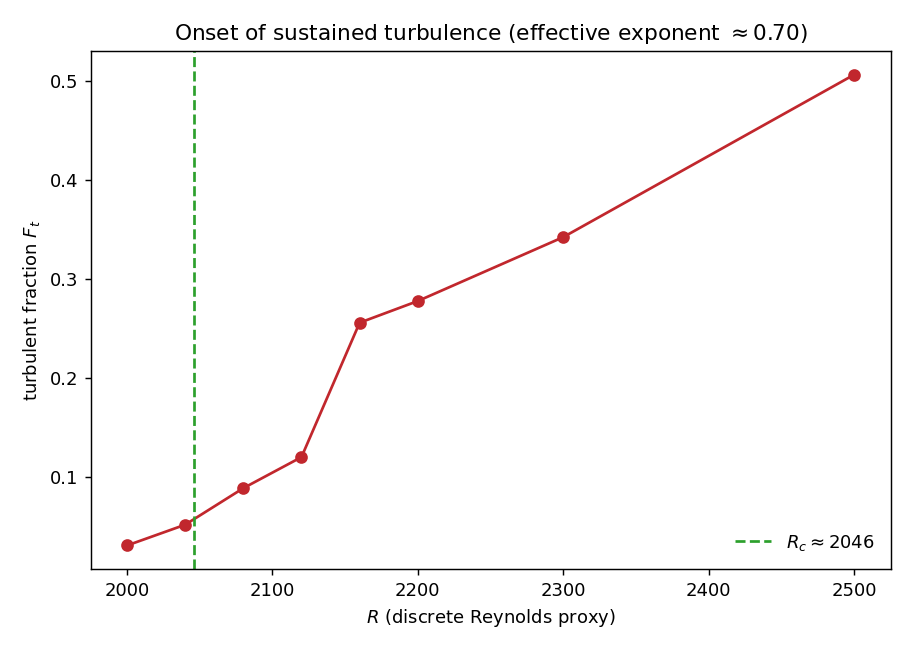

# Barkley pipe-flow: a reduced-order model of pipe-flow transition

[](https://github.com/yuvrajdabhi2212/barkley-pipe-flow/actions/workflows/ci.yml)
[](https://www.python.org/)
[](LICENSE)

> _CI/Colab links assume the repository at `github.com/yuvrajdabhi2212/barkley-pipe-flow`._

A clean, tested, CPU-only reproduction of the reduced-order model of transitional
pipe flow introduced in

> **Barkley, D. (2011).** *Simplifying the complexity of pipe flow.*
> Phys. Rev. E **84**, 016309. [doi:10.1103/PhysRevE.84.016309](https://doi.org/10.1103/PhysRevE.84.016309) · [arXiv:1101.4125](https://arxiv.org/abs/1101.4125)

The goal is a faithful, validation-first reproduction of the paper's key
results — the equilibrium-puff / expanding-slug regimes, the nullcline phase
plane, and space–time diagrams — using only NumPy, SciPy and Matplotlib so it
runs on a free Google Colab CPU instance.

> **Status.** **Both phases are implemented and validated.** Phase 1 (continuous
> two-PDE model) reproduces Barkley Figs. 1–2 and the `r_c = 0.833` transition;
> Phase 2 (discrete coupled-map-lattice model + survival statistics) reproduces
> Figs. 4, 5a and 12, including the **decay/splitting lifetime crossing at
> `R_×≈2038`** (Barkley's 2040). The test suite (88 tests) runs in CI. See
> [`ROADMAP.md`](ROADMAP.md) for precision caveats on the reduced ensembles.

---

## 1. The physics

The model reduces the high-dimensional dynamics of pipe-flow turbulence to two
coupled one-dimensional fields evolving along the pipe axis `x`:

- **`q(x, t) ≥ 0`** — a turbulence-intensity proxy (`q = 0` is laminar),
- **`u(x, t) ∈ [0, 1]`** — a centreline-velocity proxy (`u = 1` is laminar).

### Continuous model (Phase 1)

$$
\begin{aligned}
q_t + U\,q_x &= q\,\bigl[\,u + r - 1 - (r + \delta)(q - 1)^2\,\bigr] + q_{xx}, \\[4pt]
u_t + U\,u_x &= \varepsilon_1 (1 - u) - \varepsilon_2\,u\,q - u_x .
\end{aligned}
$$

The reaction term in `q` makes the laminar state **excitable**: small
perturbations decay, but a large enough one triggers a turbulent excursion. The
`u`-equation captures the slow recovery of the mean shear and its suppression by
turbulence. The extra `−u_x` on the right-hand side advects `u` slightly faster
than `q` (effective speed `U + 1` versus `U`); this speed mismatch is what gives
puffs their characteristic upstream–downstream asymmetry.

### Local dynamics, nullclines and the regime boundary

Dropping the spatial terms leaves the local reaction dynamics whose nullclines
are analytic:

- **q-nullcline** ($\dot q = 0$): $\;q = 0\;$ or $\;u = 1 - r + (r + \delta)(q - 1)^2$
- **u-nullcline** ($\dot u = 0$): $\;u = \dfrac{\varepsilon_1}{\varepsilon_1 + \varepsilon_2 q}$

The laminar point $(q,u)=(0,1)$ is a fixed point for **all** `r` and is always
linearly stable (Jacobian eigenvalues $-\delta$ and $-\varepsilon_1$). Setting
the two non-trivial nullclines equal at the core turbulent value `q = 1` gives
the critical Reynolds-number proxy

$$
r_c = \frac{\varepsilon_2}{\varepsilon_1 + \varepsilon_2} \approx 0.833 .
$$

| Regime        | Condition   | Physical picture                         |
|---------------|-------------|------------------------------------------|
| Excitable     | `r < r_c`   | Equilibrium puffs (localised, fixed size)|
| Critical      | `r ≈ r_c`   | Puff splitting / marginal expansion      |
| Bistable      | `r > r_c`   | Expanding slugs (turbulent fronts spread)|

### Parameters

| Symbol | Code name | Value | Meaning |
|--------|-----------|-------|---------|
| $\varepsilon_1$ | `EPS1` | `0.04` | `u`-relaxation rate towards laminar (slow ⇒ source of stiffness) |
| $\varepsilon_2$ | `EPS2` | `0.2`  | rate at which turbulence suppresses `u` |
| $\delta$        | `DELTA`| `0.1`  | shape parameter of the `q` reaction term |
| $r$             | `r`    | varies | Reynolds-number proxy (control parameter) |
| $U$             | `U`    | varies | bulk advection speed (removable by a co-moving frame) |

---

## 2. How to run

### Local

```bash
git clone https://github.com/yuvrajdabhi2212/barkley-pipe-flow.git
cd barkley-pipe-flow
python -m pip install -e .          # installs numpy / scipy / matplotlib
python -m pip install -e ".[test]"  # adds pytest
pytest                              # run the test suite
```

Requires Python ≥ 3.10.

### Reproduce all figures

```bash
python scripts/make_figures.py    # regenerates everything in figures/
```

### Google Colab

The notebooks in [`notebooks/`](notebooks/) run top-to-bottom on a free CPU
Colab instance:

| Notebook | Open |
|----------|------|
| `01_continuous_regimes.ipynb` — Figs. 1–2 | [](https://colab.research.google.com/github/yuvrajdabhi2212/barkley-pipe-flow/blob/main/notebooks/01_continuous_regimes.ipynb) |
| `02_space_time_diagrams.ipynb` — x–t & `r_c` sweep | [](https://colab.research.google.com/github/yuvrajdabhi2212/barkley-pipe-flow/blob/main/notebooks/02_space_time_diagrams.ipynb) |
| `03_phase2_roadmap.ipynb` — discrete model (Fig. 4) | [](https://colab.research.google.com/github/yuvrajdabhi2212/barkley-pipe-flow/blob/main/notebooks/03_phase2_roadmap.ipynb) |
| `04_survival_statistics.ipynb` — lifetimes, `τ(R)`, `F_t` | [](https://colab.research.google.com/github/yuvrajdabhi2212/barkley-pipe-flow/blob/main/notebooks/04_survival_statistics.ipynb) |

---

## 3. Validation against the paper

The continuous model is controlled by `r = O(1)`; the DNS Reynolds numbers `Re`
below are the physical states each regime corresponds to in Barkley's Fig. 1.
All figures are regenerated by `python scripts/make_figures.py`.

| Target | Regime | Continuous `r` | DNS `Re` |
|--------|--------|----------------|----------|
| **Fig. 1(d)** | equilibrium puff | `≈ 0.7` | 2000 |
| **Fig. 1(e)** | near-critical weak slug | `0.85` | 2275 |
| **Fig. 1(f)** | expanding slug | `≈ 1.0` | 3200 |

### Fig. 1 — regime profiles `q(x)`, `u(x)`



*Equilibrium puff (`r = 0.7`):* localized turbulence with a sharp front and a
long downstream `u`-recovery back to the laminar value 1 — the signature
asymmetry produced by `q` and `u` advecting at different speeds (`U` vs `U+1`).



*Expanding slug (`r = 1.0`):* a wide turbulent **plateau** sitting exactly at the
analytic bistable turbulent fixed point `(q, u) ≈ (1.34, 0.13)` — the defining
contrast with the plateau-less puff.

### Fig. 2 — `q`–`u` phase plane with analytic nullclines



At `r = 0.7` the nullclines meet only at laminar `(0, 1)` (excitable, one fixed
point); at `r = 1.0` they intersect at three points (laminar, a saddle, and the
turbulent node), and the slug trajectory rests on the turbulent node. Nullclines
and fixed points are computed in closed form in [`nullclines.py`](src/barkley_pipe/nullclines.py).

### Space–time diagrams and the `r_c` transition



In co-moving frames the regimes read off at a glance: a vertical band (puff,
constant size) → a narrow cone (weak slug) → a wide cone (slug, fast expansion).



Measuring the front-expansion rate `(c_lead − c_trail)/2` across `r` shows it
switching on **exactly at `r_c = ε₂/(ε₁+ε₂) = 0.833`** and growing monotonically
into the slug regime — a quantitative reproduction of the excitable→bistable
transition. Front speeds use a wrap-robust, centroid-centred measurement
([`diagnostics.front_kinematics`](src/barkley_pipe/diagnostics.py)).

### Phase 2 (in progress) — discrete model space-time (Barkley Fig. 4)

The discrete coupled-map-lattice model ([`discrete.py`](src/barkley_pipe/discrete.py))
adds the stochastic decay/splitting the continuous model lacks, via a
piecewise-linear tent map with an escape window (`β > 0`). Its control parameter
`R` selects the regime:



a **decaying puff** (`R = 1900`, below onset — turbulence persists chaotically
then abruptly relaminarizes), **puff splitting / proliferation** (`R = 2200`),
and an **expanding slug** (`R = 3000`). This reproduces Barkley Fig. 4.

### Phase 2 — survival statistics (Barkley Figs. 5a, 12)

Ensembles of discrete-model runs ([`statistics.py`](src/barkley_pipe/statistics.py))
turn pipe transition into a *phase transition*. (Reduced, Colab-sized ensembles,
so the numbers below are reproduction targets within tolerance.)



**Memoryless lifetimes (Fig. 12):** puff-decay survival is exponential,
`P(n) ∼ exp(−n/τ(R))` — straight on a log axis — and `τ` grows steeply
(super-exponentially) with `R`.



**The crossing (Fig. 5a):** `τ_decay(R)` rises while `τ_split(R)` falls; they
cross at **`R_×≈2038`**, reproducing Barkley's `R_×≈2040` and matching the
experimental/DNS crossover `Re = 2040 ± 10` (Avila et al. 2011) — the single
most important external validation number. Estimated by right-censored MLE since
near-onset puffs outlive the run.



**Onset (order parameter):** the turbulent fraction `F_t(R)` rises continuously
from ≈0 near `R_c≈2046`. Resolving the *precise* directed-percolation exponent
(`β_DP≈0.276`) needs critical-region sampling on large lattices; the reduced
ensembles here give a larger effective exponent (≈0.7) far from `R_c` — the
transition is reproduced, the exponent is not precision-matched (see
[`ROADMAP.md`](ROADMAP.md)).

---

## 4. Scope and caveats

Points that matter for reading the results honestly — several stressed by the
model's own author:

- **The continuous model cannot, by itself, produce puff *decay* or *splitting*.**
  Those are stochastic events requiring the discrete tent-map extension
  (Phase 2), whose spontaneous-decay parameter `β > 0` injects transient chaos.
  Phase 1 reproduces the deterministic regimes (puff / slug / front), not
  lifetime statistics.
- **`r` and `R` are different Reynolds-number proxies.** The continuous model
  uses `r = O(1)` (`r_c ≈ 0.833`); the discrete model uses `R` scaled so that
  `R ≈ 2000` corresponds to `Re ≈ 2000` (sustained-turbulence onset
  `R_c ≈ 2046.2`). They are kept distinct in the code (`r` vs `R`).
- **Exact numbers are reproduction targets within tolerance, not fitted
  constants.** Barkley deliberately did *not* fit parameters precisely — the
  phenomena are robust to parameter variation — so tests assert near-linear
  fronts, correct regime ordering, and finite bounded solutions rather than
  high-precision matches.
- **The directed-percolation exponent is `β_DP ≈ 0.2765`** (canonical (1+1)D
  value `0.276486(8)`); Barkley's quoted `0.28` is this rounded. A fitted
  exponent in the `0.26–0.29` band is a successful Phase-2 match given
  finite-size effects.

## 5. Relation to direct numerical simulation

This is a *reduced* model: it abstracts, into two scalar fields, the physics that
research-grade direct numerical simulations (DNS) resolve in full 3-D — for
example the **nsPipe** / **nsCouette** spectral codes developed in M. Avila's
group. The reduced model is valuable precisely because it reproduces the
large-scale phenomenology of transition (puffs, slugs, splitting, the
turbulent-fraction transition) at a tiny fraction of the cost, making the
*mechanism* transparent. For the modern picture connecting these levels of
description see:

> Avila, M., Barkley, D., & Hof, B. (2023). *Transition to turbulence in pipe
> flow.* Annu. Rev. Fluid Mech. **55**, 575–602.
> [doi:10.1146/annurev-fluid-120720-025957](https://doi.org/10.1146/annurev-fluid-120720-025957)

---

## 6. References

**Primary source**

1. Barkley, D. (2011). Simplifying the complexity of pipe flow.
   *Phys. Rev. E* **84**, 016309.
   [arXiv:1101.4125](https://arxiv.org/abs/1101.4125)
2. Barkley, D. (2016). Theoretical perspective on the route to turbulence in a
   pipe. *J. Fluid Mech.* **803**, P1.

**Transition-to-turbulence lineage (validation context)**

3. Avila, M., Barkley, D., & Hof, B. (2023). Transition to turbulence in pipe
   flow. *Annu. Rev. Fluid Mech.* **55**, 575–602.
4. Avila, K., Moxey, D., de Lozar, A., Avila, M., Barkley, D., & Hof, B. (2011).
   The onset of turbulence in pipe flow. *Science* **333**, 192–196.
   *(Establishes the decay/splitting crossover at `Re = 2040 ± 10` — the
   external number the Phase-2 survival statistics target.)*
5. Hof, B., Westerweel, J., Schneider, T. M., & Eckhardt, B. (2006). Finite
   lifetime of turbulence in shear flows. *Nature* **443**, 59–62.
6. Lemoult, G., Shi, L., Avila, K., Jalikop, S. V., Avila, M., & Hof, B. (2016).
   Directed percolation phase transition to sustained turbulence in Couette
   flow. *Nature Physics* **12**, 254–258.
7. Sipos, M., & Goldenfeld, N. (2011). Directed percolation describes lifetime
   and growth of turbulent puffs and slugs. *Phys. Rev. E* **84**, 035304.

**DNS codes this reduced model abstracts (the "bridge")**

8. López, J. M., Feldmann, D., Rampp, M., Vela-Martín, A., Shi, L., & Avila, M.
   (2020). nsCouette – a high-performance code for DNS of turbulent
   Taylor–Couette flow. *SoftwareX* **11**, 100395.
   [github.com/dfeldmann/nsCouette](https://github.com/dfeldmann/nsCouette)
   *(nsPipe is the pipe-flow variant.)*
9. Morón, D., et al. (2024). nsPipe-GPU — GPU-CUDA pseudo-spectral pipe-flow DNS.
   [github.com/Mordered/nsPipe-GPU](https://github.com/Mordered/nsPipe-GPU)

---

## License

[MIT](LICENSE).
